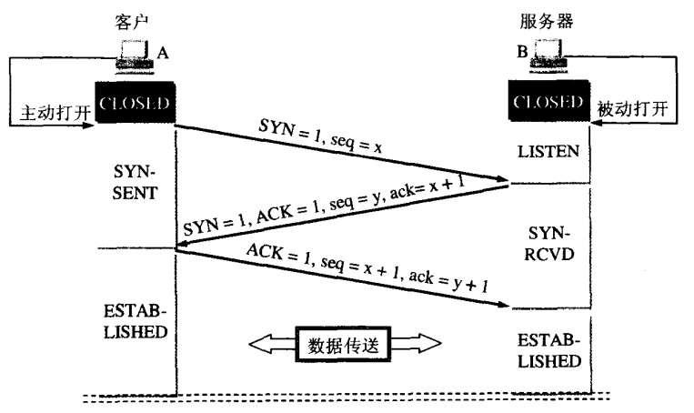
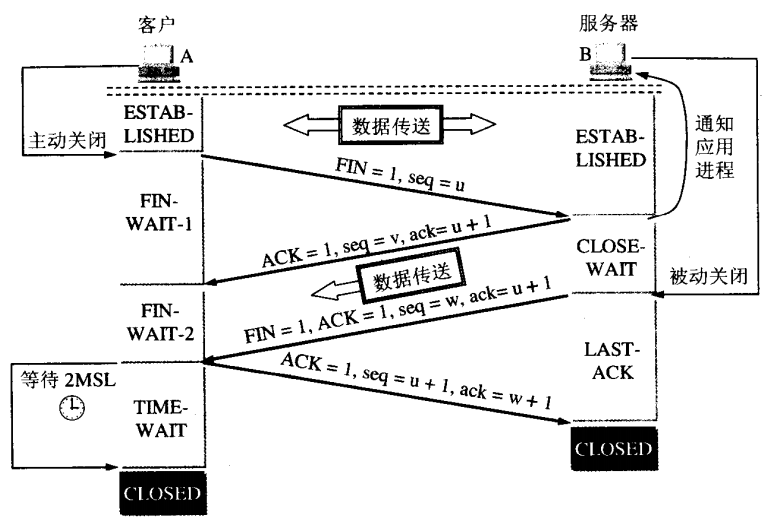

> 目录来自 [这里](https://www.nowcoder.com/discuss/435836?channel=666&source_id=home_feed) ，复习的同时把这些知识点整理出来     

> 内容大部分来自 [huihut/interview](https://github.com/huihut/interview)

> 使用 [typora](https://www.typora.io/) ( 自定义 `css` ) 保存为 PDF


# 目录
- [进程线程](#1)
    - [进程、线程的基本概念](#1-1)
        - [什么是进程、线程，彼此有什么区别](#1-1-1)
        - [多进程、多线程的优缺点](#1-1-2)
        - [什么时候用进程、线程](#1-1-3)
        - [多进程、多线程同步](#1-1-4)
    - [并发、同步、异步、互斥、阻塞、非阻塞](#1-2) 
        - [线程同步和互斥](#1-2-1)
        - [线程同步和阻塞](#1-2-2)
        - [并发、同步、异步、互斥、阻塞、非阻塞的理解](#1-2-3)
    - [孤儿进程、僵尸进程、守护进程](#1-3)
        - [基本概念](#1-3-1)
        - [如何创建守护进程](#1-3-2)
        - [正确处理僵尸进程的方法](#1-3-3)
        - [补充](#1-3-4)
- [C/C++](#2) 
    - [C/C++ 区别、概念相关](#2-1) 
        - [new 和 malloc 的区别](#2-1-1)
        - [malloc 的底层实现](#2-1-2)
        - [在 1G 内存的计算机中能否 malloc(1.2G)?](#2-1-3)
        - [指针与引用](#2-1-4)
        - [C语言检索内存情况、内存分配的方式](#2-1-5)
        - [extern"C" 的作用](#2-1-6)
        - [头文件声明时加extern 定义时不要加 因为extern可以多次声明，但只有一个定义](#2-1-7)
        - [函数参数压栈顺序，即关于 __stdcall 和 __cdecl 调用方式的理解](#2-1-8)
        - [重写 memcpy() 函数需要注意哪些问题](#2-1-9)
        - [数组到底存放在哪里](#2-1-10)
        - [struct 和 class 的区别](#2-1-11)
        - [char 和 int 之间的转换](#2-1-12)
        - [static 的用法 (定义和用途)](#2-1-13)
        - [const 用法 (定义和用途)](#2-1-14)
        - [const 常量和 #define 的区别](#2-1-15)
        - [volatile 作用和用法](#2-1-16)
        - [有常量指针 指针常量 常量引用 没有 引用常量](#2-1-17)
        - [没有指向引用的指针，因为引用是没有地址的，但是有指针的引用](#2-1-18)
        - [C/C++ 中变量的作用域](#2-1-19)
        - [C++ 类型转换机制](#2-1-20)
    - [继承、多态相关](#2-2)
        - [继承和虚继承](#2-2-1)
        - [多态的类，内存布局是怎么样的](#2-2-2)
        - [被隐藏的基类函数如何调用或者子类调用父类的同名函数和父类成员变量](#2-2-3)
        - [多态实现的三个条件](#2-2-4)
        - [拷贝构造函数与深浅拷贝](#2-2-5)
        - [什么情况下会调用拷贝构造函数 (三种情况)](#2-2-6)
        - [析构函数可以抛出异常吗?](#2-2-7)
        - [析构函数一般写成虚函数的原因](#2-2-8)
        - [构造函数为什么一般不定义为虚函数](#2-2-9)
        - [纯虚函数](#2-2-10)
        - [静态绑定和动态绑定](#2-2-11)
        - [C++ 的构造函数](#2-2-12)
        - [重写 (覆盖)、重载、隐藏的区别](#2-2-13)
        - [成员初始化列表](#2-2-14)
        - [如何避免编译器进行的隐式类型转换 (explicit)](#2-2-15)
- [网络编程](#3)
    - [TCP UDP](#3-1)
        - [TCP、UDP 区别](#3-1-1)
        - [TCP、UDP 优缺点](#3-1-2)
        - [TCP、UDP 适用场景](#3-1-3)
        - [TCP 为什么是可靠连接](#3-1-4)
        - [典型网络模型，简单说说有哪些](#3-1-5)
        - [Http1.1 和 Http1.0 的区别](#3-1-6)
        - [URI (统一资源标识符) 和 URL (统一资源定位符) 之间的区别](#3-1-7)
    - [三次握手、四次挥手 ](#3-2)
        - [什么是三次握手](#3-2-1)
        - [为什么三次握手中客户端还要发送一次确认呢?可以二次握手吗?](#3-2-2)
        - [为什么服务端易受到 SYN 攻击?](#3-2-3)
        - [什么是四次挥手](#3-2-4)
        - [为什么客户端最后还要等待 2MSL?](#3-2-5)
        - [为什么建立连接是三次握手，关闭连接却是四次挥手呢?](#3-2-6)
- [常见算法](#4) 
    - [排序算法](#4-1) 
        - [各种排序算法的时间空间复杂度、稳定性](#4-1-1)
        - [各种排序算法什么时候有最好情况、最坏情况](#4-1-2)
    - [STL](#4-2)
        - [vector list异同](#4-2-1)
        - [vector 内存是怎么增长的](#4-2-1)
        - [vector 和 deque 的比较](#4-2-1)
        - [sort](#4-2-1)
        - [STL底层数据结构实现](#4-2-1)
        - [利用迭代器删除元素会发生什么？](#4-2-1)
        - [map是如何实现的，查找效率是多少](#4-2-1)
        - [几种模板插入的时间复杂度](#4-2-1)
- [Linux操作系统常见面试题](#5) 
    - [Linux 内核相关](#5-1)
    - [其他操作系统常见面试题](#5-2)
        - [大小端](#5-2-1)
        - [一个程序从开始运行到结束的完整过程 (四个过程)](#5-2-2)
- [附录](#appendix)
    - [排序算法](#sort-algorithm)	
<div STYLE="page-break-after: always;"></div>

<a id="1"></a>

# 进程线程

<a id="1-1"></a>

## 1.1 进程、线程的基本概念 `⭐⭐⭐⭐⭐` 

<a id="1-1-1"></a>

### 1.1.1 什么是进程、线程，彼此有什么区别 `⭐⭐⭐⭐⭐`

进程是系统资源分配的独立实体，每个进程都拥有独立的地址空间。一个进程无法访问另一个进程的变量和数据结构，如果想让一个进程访问另一个进程的资源，需要使用进程间通信，比如管道，文件，套接字等。

 一个进程可以拥有多个线程，每个线程使用其所属进程的栈空间。线程与进程的一个主要区别是，同一进程内的多个线程会共享部分状态，多个线程可以读写同一块内存（一个进程无法直接访问另一进程的内存）。同时，每个线程还拥有自己的寄存器和栈，其他线程可以读写这些栈内存。

线程是进程的一个实体，是进程的一条执行路径。

线程是进程的一个特定执行路径。当一个线程修改了进程的资源，它的兄弟线程可以立即看到这种变化。

<a id="1-1-2"></a>

### 1.1.2 多进程、多线程的优缺点 `⭐⭐⭐⭐` 

**对比**
|<center>对比维度</center>|<center>多进程</center>|<center>多线程</center>|<center>总结</center>|
|:--|:--|:--|:--|
|数据共享、同步|数据共享复杂，需要用IPC；<br>数据是分开的，同步简单|因为共享进程数据，数据共享简单；<br>但也因为这个原因导致同步复杂|各有优势|
|内存、CPU|占用内存多，切换复杂，CPU利用率低|占用内存少，切换简单，CPU利用率高|线程占优|
|创建销毁、切换|创建销毁、切换复杂，速度慢|创建销毁、切换简单，速度很快|线程占优|
|编程、调试|编程、调试简单|编程、调试复杂||
|可靠性|进程间不会互相影响|一个线程挂掉将导致整个进程挂掉||
|分布式|适用于多核、多机分布式；<br>如果一台机器不够，扩展到多台机器比较简单|适用于多核分布式||

**优劣**
|<center>优劣</center>|<center>多进程</center>|<center>多线程</center>|
|:--|:--|:--|
|优点|编程、调试简单，可靠性较高|创建、销毁、切换速度快，内存、资源占用小|
|缺点|创建、销毁、切换速度慢，内存、资源占用大|编程、调试复杂，可靠性较差|

<a id="1-1-3"></a>

### 1.1.3 什么时候用进程，什么时候用线程 `⭐⭐⭐` 
- 需要频繁创建销毁的优先使用线程；因为对进程来说创建和销毁一个进程的代价是很大的
- 线程的切换速度快，所以在需要大量计算、切换频繁时使用线程，还有耗时的操作时用使用线程可提高应用程序的响应
- 因为对 CPU 系统的效率使用上线程更占优势，所以可能要发展到多机分布的用进程，多核分布用线程
- 并行操作时用线程，如 C/S 架构的服务器端并发线程响应用户的请求
- 需要更稳定安全时，适合选择进程；需要速度时，选择线程更好

<a id="1-1-4"></a>

### 1.1.4 多进程、多线程同步 (通讯) 的方法 `⭐⭐⭐⭐⭐` 
#### 进程之间的通信方式以及优缺点
- **管道** (PIPE)
    - **有名管道**：一种半双工的通信方式，它允许无亲缘关系进程间的通信
        - 优点：可以实现任意关系的进程间的通信
        - 缺点：
            - 长期存于系统中，使用不当容易出错
            - 缓冲区有限
    - **无名管道**：一种半双工的通信方式，只能在具有亲缘关系的进程间使用 (父子进程)
        - 优点：简单方便
        - 缺点：
            - 局限于单向通信
            - 只能创建在它的进程以及其有亲缘关系的进程之间
            - 缓冲区有限
- **信号量** (Semaphore) ：一个计数器，可以用来控制多个线程对共享资源的访问
    - 优点：可以同步进程
    - 缺点：信号量有限
- **信号** (Signal) ：一种比较复杂的通信方式，用于通知接收进程某个事件已经发生
- **消息队列** (Message Queue) ：是消息的链表，存放在内核中并由消息队列标识符标识
    - 优点：可以实现任意进程间的通信，并通过系统调用函数来实现消息发送和接收之间的同步，无需考虑同步问题，方便
    - 缺点：信息的复制需要额外消耗 CPU 的时间，不适宜于信息量大或操作频繁的场合
- **共享内存** (Shared Memory) ：映射一段能被其他进程所访问的内存，这段共享内存由一个进程创建，但多个进程都可以访问
    - 优点：无须复制，快捷，信息量大
    - 缺点：
- 通信是通过将共享空间缓冲区直接附加到进程的虚拟地址空间中来实现的，因此进程间的读写操作的同步问题
- 利用内存缓冲区直接交换信息，内存的实体存在于计算机中，只能同一个计算机系统中的诸多进程共享，不方便网络通信

- **套接字** (Socket) ：可用于不同计算机间的进程通信
    - 优点：
        - 传输数据为字节级，传输数据可自定义，数据量小效率高
        - 传输数据时间短，性能高
        - 适合于客户端和服务器端之间信息实时交互
        - 可以加密,数据安全性强
    - 缺点：需对传输的数据进行解析，转化成应用级的数据

#### 线程之间的通信方式
- 锁机制：包括互斥锁/量（mutex）、读写锁（reader-writer lock）、自旋锁（spin lock）、条件变量（condition）
    - 互斥锁/量（mutex）：提供了以排他方式防止数据结构被并发修改的方法。
    - 读写锁（reader-writer lock）：允许多个线程同时读共享数据，而对写操作是互斥的。
    - 自旋锁（spin lock）与互斥锁类似，都是为了保护共享资源。互斥锁是当资源被占用，申请者进入睡眠状态；而自旋锁则循环检测保持者是否已经释放锁。
    - 条件变量（condition）：可以以原子的方式阻塞进程，直到某个特定条件为真为止。对条件的测试是在互斥锁的保护下进行的。条件变量始终与互斥锁一起使用。
- 信号量机制 (Semaphore)
    - 无名线程信号量
    - 命名线程信号量
- 信号机制 (Signal) ：类似进程间的信号处理
- 屏障 (barrier)：屏障允许每个线程等待，直到所有的合作线程都达到某一点，然后从该点继续执行。

线程间通信的目的主要是用于线程同步，所以线程没有像进程通信中的用于数据交换的通信机制

<a id="1-1-5"></a>

### 1.1.5 进程的空间模型⭐⭐⭐⭐ 
Linux 下使用虚拟内存空间给每一个进程，32 位操作系统下，每个进程都有独立的 4G 虚拟内存空间。

其中包括：

1、内核区：用户代码不可见的区域，页表就存放在这个区域中。

2、用户区：
- a、代码段：只可读，不可写，程序代码段。
- b、数据段：保存全局变量，静态变量的区域。
- c、堆区：就是动态内存，通过 `malloc`，`new` 申请内存，有一个堆指针，可以通过 `brk` 系统调用调整堆指针。
- d、文件映射区域：通过 `mmap` 系统调用，如动态库，共享内存等映射物理空间的内存区域。可以单独释放，不会产生内存碎片。
- e、栈区：用于维护函数调用的上下文空间，用 `ulimit -s` 查看。一般默认为 8M

> [参考](https://blog.csdn.net/gfgdsg/article/details/42709943)

<a id="1-1-6"></a>

### 1.1.6 进程线程的状态转换图 什么时候阻塞，什么时候就绪⭐⭐⭐ 

<a id="1-1-7"></a>

### 1.1.7 父进程、子进程的关系以及区别⭐⭐⭐⭐

<a id="1-1-8"></a>

### 1.1.8 什么是进程上下文、中断上下文⭐⭐ 

<a id="1-1-9"></a>

### 1.1.9 一个进程可以创建多少线程，和什么有关⭐⭐ 

<a id="1-2"></a>

## 1.2 并发，同步，异步，互斥，阻塞，非阻塞的理解 

<a id="1-2-1"></a>

### 1.2.1 什么是线程同步和互斥 `⭐⭐⭐⭐⭐` 

- 互斥是指某一资源同时只允许一个访问者对其进行访问，具有唯一性和排它性。但互斥无法限制访问者对资源的访问顺序，即访问是无序的
- 同步是指在互斥的基础上（大多数情况），通过其它机制实现访问者对资源的有序访问
- 同步其实已经实现了互斥，所以同步是一种更为复杂的互斥
- 互斥是一种特殊的同步

所谓互斥，就是不同线程通过竞争进入临界区（共享的数据和硬件资源），为了防止访问冲突，在有限的时间内只允许其中之一独占性的使用共享资源。如不允许同时写

同步关系则是多个线程彼此合作，通过一定的逻辑关系来共同完成一个任务。一般来说，同步关系中往往包含互斥，同时对临界区的资源会按照某种逻辑顺序进行访问。如先生产后使用

总的来说，两者的区别就是：
- 互斥是通过竞争对资源的独占使用，彼此之间不需要知道对方的存在，执行顺序是一个乱序
- 同步是协调多个相互关联线程合作完成任务，彼此之间知道对方存在，执行顺序往往是有序的

<a id="1-2-2"></a>

### 1.2.2 线程同步与阻塞的关系?同步一定阻塞吗?阻塞一定同步吗? `⭐⭐⭐⭐` 

**同步是个过程，阻塞是线程的一种状态**。
多个线程操作共享变量时可能会出现竞争。这时需要同步来防止两个以上的线程同时进入临界区，在这个过程中，后进入临界区的线程将阻塞，等待先进入的线程走出临界区

**线程同步不一定发生阻塞**。线程同步的时候，需要协调推进速度，互相等待和互相唤醒会发生阻塞

> 是不是可以理解为，线程同步时会产生阻塞，即“线程同步不一定发生阻塞、阻塞一定同步”？

<a id="1-2-3"></a>

### 1.2.3 并发，同步，异步，互斥，阻塞，非阻塞的理解 `⭐⭐⭐⭐⭐`

**同步**

- 同步，就是在发出一个功能调用时，在没有得到结果之前，该调用就不返回
- 要想实现同步操作，必须要获得线程的对象锁。获得它可以保证在同一时刻只有一个线能够进入临界区，并且在这个锁被释放之前，其他的线程都不能再进入这个临界区。如果其他线程想要获得这个对象的锁，只能进入等待队列等待。只有当拥有该对象锁的线程退出临界区时，锁才会被释放，等待队列中优先级最高的线程才能获得该锁。
- 实现同步的方式有两种：同步方法、同步代码块

**异步**
- 当一个异步过程调用发出后，调用者不会立刻得到结果。实际处理这个调用的部件是在调用发出后，**通过状态、通知来通知调用者，或通过回调函数处理这个调用**  
- 由于每个线程都包含了运行时自身所需要的数据或方法，因此，在进行输入输出时，不必关心其他线程的状态或行为，也不必等到输入输出处理完毕才返回。当应用程序在对象上调用了一个需要花费很长时间来执行的方法，并且不希望让程序等待方法的返回时，就应该使用异步编程，异步能够提高程序的效率

**阻塞**
- 阻塞调用是指调用结果返回之前，当前线程会被挂起。函数只有在得到结果之后才会返回

**非阻塞**
- 指在不能立刻得到结果之前，该函数不会阻塞当前线程，而会立刻返回

**并发**
- 并发和并行都能表示两个或多个任务一起执行，但是并发偏重于任务交替执行，多个任务之间很可能是串行的，而并行是真正意义上的"同时执行"

<a id="1-3"></a>

## 1.3 孤儿进程、僵尸进程、守护进程的概念 
> [参考](https://blog.csdn.net/wumenglu1018/article/details/53406537)

<a id="1-3-1"></a>

### 1.3.1 基本概念 `⭐⭐⭐⭐⭐` 
在 unix/linux 中，正常情况下，子进程是通过父进程创建的，子进程在创建新的进程。        
子进程的结束和父进程的运行是一个异步过程，即父进程永远无法预测子进程到底什么时候结束。当一个进程完成它的工作终止之后，它的父进程需要调用 `wait()` 或者`waitpid()` 系统调用取得子进程的终止状态。        

- 如果一个子进程结束了，但是他的父进程没有等待他, 那么这个子进程将变成一个僵尸进程
- 但是如果该进程的父进程已经先结束了，那么该进程就不会变成僵尸进程，因为每个进程结束的时候，系统都会扫描当前系统中所运行的所有进程，看有没有哪个进程是刚刚结束的这个进程的子进程，如果是的话，就由 `Init`（进程号为1）来接管他，成为他的父进程，此时称这个进程为孤儿进程，其状态收集工作由 `Init` 进程负责

**孤儿进程**

一个父进程退出，而它的一个或多个子进程还在运行，那么那些子进程将成为孤儿进程。孤儿进程将被 `Init` 进程所收养，并由 `Init` 进程对它们完成状态收集工作

**僵尸进程**

一个进程使用 `fork` 创建子进程，如果子进程退出，而父进程并没有调用 `wait` 或 `waitpid` 获取子进程的状态信息，那么子进程的进程描述符仍然保存在系统中。这种进程称之为僵尸进程

**守护进程**

守护进程就是在后台运行，不与任何终端关联的进程，通常情况下守护进程在系统启动时就在运行，它们以 root 用户或者其他特殊用户( apache 和 postfix )运行，并能处理一些系统级的任务。习惯上守护进程的名字通常以 d 结尾 (sshd)，但这不是必须的。

<a id="1-3-2"></a>

### 1.3.2 如何创建守护进程：⭐⭐ 

<a id="1-3-3"></a>

### 1.3.3 正确处理僵尸进程的方法 `⭐⭐⭐⭐`
#### 通过信号机制
子进程退出时向父进程发送 `SIGCHILD` 信号，父进程处理 `SIGCHILD` 信号。在信号处理函数中调用 `wait` 进行处理僵尸进程。
```c
#include<stdio.h>
#include<unistd.h>
#include<stdlib.h>
#include<signal.h>

static voidsig_child(int signo);

int main() {
    ...
    // 创建捕捉子进程退出信号
    signal(SIGCHLD, sig_child);
    ...
}

static void sig_child(int signo){
    pid_t pid;
    int   stat;
    // 处理僵尸进程
    while ((pid = waitpid(-1, &stat, WNOHANG)) > 0)
        printf("child %dterminated.\n", pid);
}
```

#### 两次 `fork`（ `kill` 父进程）
原理是将子进程成为孤儿进程，从而其的父进程变为 `Init` 进程，通过 `Init` 进程可以处理僵尸进程
```c
#include<stdio.h>
#include<stdlib.h>
#include<unistd.h>
#include<errno.h>

int main() {
    pid_t pid;
    // 创建第一个子进程
    pid = fork();
    if (pid < 0) {
        perror("fork error:");
        exit(1);
    }

    // 第一个子进程
    else if (pid == 0) {
        printf("I am the first childprocess.pid:%d\tppid:%d\n",getpid(),getppid());

        // 子进程再创建子进程
        pid = fork();
        if (pid < 0) {
            perror("fork error:");
            exit(1);
        }

        // 第一个子进程退出
        else if (pid > 0) {
            printf("first procee isexited.\n");
            exit(0);
        }

        // 第二个子进程
        // 睡眠 3s 保证第一个子进程退出，这样第二个子进程的父亲就是init进程里
        sleep(3);
        printf("I am the second childprocess.pid: %d\tppid:%d\n",getpid(),getppid());
        exit(0);
    }

    // 父进程处理第一个子进程退出
    if (waitpid(pid, NULL, 0) != pid) {
        perror("waitepid error:");
        exit(1);
    }

    exit(0);
    return 0;
}
```

<a id="1-3-4"></a>

### 1.3.4 补充
#### 孤儿进程有危害吗？

孤儿进程是没有父进程的进程，孤儿进程这个重任就落到了 `Init` 进程身上。      
每当出现一个孤儿进程的时候，内核就把孤儿进程的父进程设置为 `Init`，而 `init` 进程会循环地 `wait()` 它的已经退出的子进程。因此孤儿进程并不会有什么危害

#### 僵尸进程有危害吗？
例如有个进程，它定期的产生一个子进程，这个子进程需要做的事情很少，做完它该做的事情之后就退出了，因此这个子进程的生命周期很短，但是，父进程只管生成新的子进程，至于子进程退出之后的事情，则一概不闻不问，这样，系统运行上一段时间之后，系统中就会存在很多的僵死进程，倘若**用 `ps` 命令查看**的话，就会看到很多状态为 `Z` 的进程。 

严格地来说，僵死进程并不是问题的根源，罪魁祸首是产生出大量僵死进程的那个父进程。因此，当我们寻求如何消灭系统中大量的僵死进程时，答案就是把产生大量僵死进程的那个元凶枪毙掉（也就是通过 `kill` 发送 `SIGTERM` 或者 `SIGKILL` 信号啦）。      
枪毙了元凶进程（父进程）之后，它产生的僵死进程就变成了孤儿进程，这些孤儿进程会被 `Init` 进程接管，`Init` 进程会 `wait()` 这些孤儿进程，释放它们占用的系统进程表中的资源，这样，这些已经僵死的孤儿进程就能瞑目而去了。      
这就是守护进程的作用，如果发生大量的僵尸进程，守护进程就会查找其父进程，然后无情的 `kill` 掉！

#### 为什么要尽量避免僵尸进程？
僵尸进程不是活着的进程，可以说就是一个数据结构，它是已经完成的任务的进程，但是不是它完成任务后就会烟消云散的，他会留下一点东西，这个东西就是他的进程 `Id`，他的结束状态等.       

为什么会留下这个东西呢？        

因为这个是用来向他的父进程报告自己的完成状况的，父进程创建一个进程是用来完成任务，父进程需要知道子进程的完成情况，所以出现这样的机制，对于僵尸进程只有父进程自己可以清理掉，调用 `wait` 等命令就可以了。

但是父进程不清理怎么办，那就说明存在僵尸进程，浪费了进程 `Id`，进程 `id` 是一种有限资源，用一个少一个，所以如果存在大量的僵尸进程，解决方法可以是 `kill` 父进程，把子进程交由 `Init` 进程处理。

系统中的进程数量是有限的，虽然僵尸进程占用的资源和内存都比较少，但是它却占领着进程 `ID`，可能会导致系统无法再创建新的进程，因此及时清除僵尸进程很重要！

<a id="2"></a>

# C/C++

<a id="2-1"></a>

## 2.1 C 和 C++ 区别、概念相关

<a id="2-1-1"></a>

### 2.1.1 `new` 和 `malloc` 的区别 `⭐⭐⭐⭐⭐` 
> [参考](https://blog.csdn.net/nie19940803/article/details/76358673)

#### 属性
`new`/`delete` 是 C++ 关键字，需要编译器支持。`malloc`/`free` 是库函数，需要头文件支持。

#### 参数
使用 `new` 操作符申请内存分配时无须指定内存块的大小，编译器会根据类型信息自行计算。而 `malloc` 则需要显式地指出所需内存的尺寸。
#### 返回类型
`new` 操作符内存分配成功时，返回的是对象类型的指针，类型严格与对象匹配，无须进行类型转换，故 `new` 是符合类型安全性的操作符。而 `malloc` 内存分配成功则是返回 `void *` ，需要通过强制类型转换将 `void *` 指针转换成我们需要的类型。

#### 分配失败
`new` 内存分配失败时，会抛出 `bad_alloc` 异常。`malloc` 分配内存失败时返回 `NULL`。

#### 自定义类型
`new` 会先调用 `operator new` 函数，申请足够的内存（通常底层使用 `malloc` 实现）。然后调用类型的构造函数，初始化成员变量，最后返回自定义类型指针。`delete` 先调用析构函数，然后调用 `operator delete` 函数释放内存（通常底层使用 `free` 实现）。

`malloc`/`free` 是库函数，只能动态的申请和释放内存，无法强制要求其做自定义类型对象构造和析构工作。

#### 重载
C++ 允许重载 `new`/`delete` 操作符，特别的，布局 `new` 的就不需要为对象分配内存，而是指定了一个地址作为内存起始区域，`new` 在这段内存上为对象调用构造函数完成初始化工作，并返回此地址。而 `malloc` 不允许重载。
#### 内存区域
`new` 操作符从自由存储区（`free store`）上为对象动态分配内存空间，而 `malloc` 函数从堆上动态分配内存。自由存储区是 C++ 基于 `new` 操作符的一个抽象概念，凡是通过 `new` 操作符进行内存申请，该内存即为自由存储区。而堆是操作系统中的术语，是操作系统所维护的一块特殊内存，用于程序的内存动态分配，C 语言使用 `malloc` 从堆上分配内存，使用 `free` 释放已分配的对应内存。自由存储区不等于堆，如上所述，布局 `new` 就可以不位于堆中。

<a id="2-1-2"></a>

### 2.1.2 `malloc` 的底层实现 `⭐⭐⭐⭐` 
> [malloc 底层实现及原理](https://www.cnblogs.com/zpcoding/p/10808969.html)

- 当开辟的空间小于 128K 时，调用 `brk()` 函数，`malloc` 的底层实现是系统调用函数 `brk()`，其主要移动指针 `_enddata` (此时的 `_enddata` 指的是 Linux 地址空间中堆段的末尾地址，不是数据段的末尾地址)
- 当开辟的空间大于 128K 时，`mmap()` 系统调用函数来在虚拟地址空间中（堆和栈中间，称为“文件映射区域”的地方）找一块空间来开辟。

<a id="2-1-3"></a>

### 2.1.3 在 1G 内存的计算机中能否 `malloc(1.2G)`?为什么? `⭐⭐`

`malloc` 能够申请的空间大小与物理内存的大小没有直接关系，仅与程序的虚拟地址空间相关

程序运行时，堆空间只是程序向操作系统申请划出来的一大块虚拟地址空间。应用程序通过 `malloc` 申请空间，得到的是在虚拟地址空间中的地址，之后程序运行所提供的物理内存是由操作系统完成的

Windows 下 32 位程序如果单纯看地址空间能有 4G 左右的内存可用，不过实际上系统会把其中 2G 的地址留给内核使用，所以此时程序最大能用2G的内存。除去其他开销，能用 `malloc` 申请到的内存只有 1.9G 左右

<a id="2-1-4"></a>

### 2.1.4 指针与引用的相同和区别；如何相互转换？⭐⭐⭐⭐⭐ 

<a id="2-1-5"></a>

### 2.1.5 C语言检索内存情况 内存分配的方式⭐⭐⭐ 

<a id="2-1-6"></a>

### 2.1.6 `extern"C"` 的作用 `⭐⭐⭐` 
`extern "C"` 的作用是让 C++ 编译器将 `extern "C"` 声明的代码当作 C 语言代码处理，可以避免 C++ 因符号修饰导致代码不能和 C 语言库中的符号进行链接的问题。

<a id="2-1-7"></a>

### 2.1.7 头文件声明时加 `extern` 定义时不要加 因为 `extern` 可以多次声明，但只有一个定义⭐⭐⭐⭐ 

<a id="2-1-8"></a>

### 2.1.8 函数参数压栈顺序，即关于 __stdcall 和 __cdecl 调用方式的理解⭐⭐⭐ 

<a id="2-1-9"></a>

### 2.1.9 重写 `memcpy()` 函数需要注意哪些问题⭐⭐ 

<a id="2-1-10"></a>

### 2.1.10 数组到底存放在哪里⭐⭐⭐ 

<a id="2-1-11"></a>

### 2.1.11 `struct` 和 `class` 的区别 `⭐⭐⭐⭐⭐` 
`struct` 更适合看成是一个数据结构的实现体，`class` 更适合看成是一个对象的实现体。

在 C++ 中，`class` 和 `struct` 做类型定义是只有两点区别：
- 成员的默认访问权限。`class` 的成员默认是 `private` 权限，`struct` 默认是 `public` 权限；默认继承权限不同，`class` 继承默认是 `private` 继承，而 `struct` 默认是 `public` 继承
- `class` 还可用于定义模板参数，像 `typename` ，但是关键字 `struct` 不能同于定义模板参数

C++ 保留 `struct` 关键字，原因
- 保证与 C 语言的向下兼容性，C++ 必须提供一个 `struct`
- C++ 中的 `struct` 定义必须百分百地保证与 C 语言中的 `struct` 的向下兼容性，把 C++ 中的最基本的对象单元规定为 `class` 而不是 `struct`，就是为了避免各种兼容性要求的限制
- 对 `struct` 定义的扩展使 C 语言的代码能够更容易的被移植到 C++ 中

<a id="2-1-12"></a>

### 2.1.12 `char` 和 `int` 之间的转换 `⭐⭐⭐` 
```cpp
// 通过 ascii码
char a = '0';
int ia = (int)a;
ia = ia - 48
// 直接转
int ib = a - '0';
```

<a id="2-1-13"></a>

### 2.1.13 `static` 的用法 (定义和用途) `⭐⭐⭐⭐⭐`
1. 修饰**普通变量**，修改变量的存储区域和生命周期，使变量存储在静态区，在 `main` 函数运行前就分配了空间，如果有初始值就用初始值初始化它，如果没有初始值系统用默认值初始化它
2. 修饰**普通函数**，表明函数的作用范围，仅在定义该函数的文件内才能使用。在多人开发项目时，为了防止与他人命名空间里的函数重名，可以将函数定位为 `static`
3. 修饰**成员变量**，修饰成员变量使所有的对象只保存一个该变量，而且不需要生成对象就可以访问该成员
4. 修饰**成员函数**，修饰成员函数使得不需要生成对象就可以访问该函数，但是在 `static` 函数内不能访问非静态成员

<a id="2-1-14"></a>

### 2.1.14 `const` 的用法 (定义和用途) `⭐⭐⭐⭐⭐`
1. 修饰**变量**，说明该变量不可以被改变；
2. 修饰**指针**，分为指向常量的指针 (`pointer to const`) 和自身是常量的指针 (常量指针，`const pointer`)
3. 修饰**引用**，指向常量的引用 (`reference to const`)，用于形参类型，即避免了拷贝，又避免了函数对值的修改
4. 修饰**成员函数**，说明该成员函数内不能修改成员变量

<a id="2-1-15"></a>

### 2.1.15 `const` 常量和 `#define` 的区别 (编译阶段、安全性、内存占用等)  `⭐⭐⭐⭐` 
> [const（常量）和#define（宏定义）区别](https://www.cnblogs.com/xumaomao/articles/11049541.html)

宏定义在编译时把所有用到宏定义值的地方用宏定义常量替换。`const` 常量可以看作是一个只读变量，需要指定类型，需要分配内存，有自己的作用域

#### 编译器处理不同
宏定义是一个“编译时”概念，在预处理阶段展开（在编译时把所有用到宏定义值的地方用宏定义常量替换），不能对宏定义进行调试，生命周期结束于编译时期；

`const` 常量是一个“运行时”概念，在程序运行使用，类似于一个只读行数据

#### 存储方式不同
宏定义是直接替换，不会分配内存，存储于程序的代码段中；

`const` 常量需要进行内存分配

#### 类型和安全检查不同
宏定义是字符替换，没有数据类型的区别，同时这种替换没有类型安全检查，可能产生边际效应等错误；

`const` 常量是常量的声明，有类型区别，需要在编译阶段进行类型检查

#### 定义域不同
```cpp
void f1 () {
    #define N 12
    const int n 12;
}
void f2 () {
    cout << N <<endl; // 正确，N已经定义过，不受定义域限制
    cout << n <<endl; // 错误，n定义域只在f1函数中
}
```
#### 是否可以做函数参数
宏定义不能作为参数传递给函数

`const` 常量可以在函数的参数列表中出现

#### 定义后能否取消
宏定义可以通过 `#undef` 来使之前的宏定义失效

`const` 常量定义后将在定义域内永久有效

```cpp
void f1() {
  #define N 12
  const int n = 12;
  #undef N  // 取消宏定义后，即使在 f1函数中，N也无效了
  #define N 21 // 取消后可以重新定义
}
```

<a id="2-1-16"></a>

### 2.1.16 `volatile` 作用和用法 `⭐⭐⭐⭐⭐`
```cpp
volatile int a = 1;
```
- `volatile` 关键字是一种类型修饰符，用它声明的类型变量表示可以被某些编译器未知的因素 (操作系统、硬件、其它线程等) 更改。所以使用 `volatile` 告诉编译器不应对这样的对象进行优化。
- `volatile` 关键字声明的变量，每次访问时都必须从内存中取出值 (没有被 `volatile` 修饰的变量，可能由于编译器的优化，从 CPU 寄存器中取值)
- `const` 可以是 `volatile` (如只读的状态寄存器)
- 指针可以是 `volatile`

<a id="2-1-17"></a>

### 2.1.17 有常量指针 指针常量 常量引用 没有 引用常量⭐⭐⭐ 

<a id="2-1-18"></a>

### 2.1.18 没有指向引用的指针，因为引用是没有地址的，但是有指针的引用⭐⭐⭐ 

<a id="2-1-19"></a>

### 2.1.19 C/C++中变量的作用域 `⭐⭐⭐⭐⭐`
> [c/c++中变量的作用域](https://www.cnblogs.com/eliu/p/8484637.html)

<a id="2-1-20"></a>

### 2.1.20 C++中类型转换机制 `⭐⭐⭐` 

#### `static_cast`
- 用于非多态类型的转换
- 不执行运行时类型检查 (转换安全性不如 `dynamic_cast`)
- 通常用于转换数值数据类型 (如 `float` -> `int`)
- 可以在整个类层次结构中移动指针，子类转化为父类安全（向上转换），父类转化为子类不安全（因为子类可能有不在父类的字段或方法）
#### `dynamic_cast`
- 用于多态类型的转换
- 执行行运行时类型检查
- 只适用于指针或引用
- 对不明确的指针的转换将失败 (返回 `nullptr`)，但不引发异常
- 如果转换目标是引用类型并且失败了，则 `dynamic_cast` 运算符将抛出一个 `std::bad_cast` 异常
- 可以在整个类层次结构中移动指针，包括向上转换、向下转换
#### `const_cast`
- 用于删除 `const`、`volatile` 和 `__unaligned` 特性（如将 `const int` 类型转换为 `int` 类型 ）
#### `reinterpret_cast`
- 用于位的简单重新解释
- 滥用 `reinterpret_cast` 运算符可能很容易带来风险。 除非所需转换本身是低级别的，否则应使用其他强制转换运算符之一
- 允许将任何指针转换为任何其他指针类型（如 `char*` 到 `int*` 或 `One_class*` 到 `Unrelated_class*` 之类的转换，但其本身并不安全）
- 也允许将任何整数类型转换为任何指针类型以及反向转换
- `reinterpret_cast` 运算符不能丢掉 `const`、`volatile` 或 `__unaligned` 特性
- `reinterpret_cast` 的一个实际用途是在哈希函数中，即让两个不同的值 (地址值) 几乎不会产生相同的哈希值
```cpp
#include <iostream>
using namespace std;

// Returns a hash code based on an address
unsigned short Hash( void *p ) {
   unsigned int val = reinterpret_cast<unsigned int>( p );
   return ( unsigned short )( val ^ (val >> 16));
}

int main() {
   int a[20];
   for ( int i = 0; i < 20; i++ )
      cout << Hash( a + i ) << endl;
}
```

#### `bad_cast`
因为不存在所谓空引用，所以引用类型的 `dynamic_cast` 转换与指针类型不同，在引用转换失败时，会抛出 `std::bad_cast` 异常，该异常定义在头文件 `typeinfo` 中
```cpp
try {  
    Circle& ref_circle = dynamic_cast<Circle&>(ref_shape);   
}  
catch (bad_cast b) {  
    cout << "Caught: " << b.what();  
} 
```

<a id="2-2"></a>

## 2.2 继承、多态 `⭐⭐⭐⭐⭐`

<a id="2-2-1"></a>

### 2.2.1 继承和虚继承 `⭐⭐⭐⭐⭐`

虚继承用于解决多继承条件下的菱形继承问题 (浪费存储空间、存在二义性)

底层实现原理与编译器相关，一般通过虚基类指针和虚基类表实现，每个虚继承的子类都有一个虚基类指针 (占用一个指针的存储空间，4字节) 和虚基类表 (不占用类对象的存储空间) (需要强调的是，虚基类依旧会在子类里面存在拷贝，只是仅仅最多存在一份而已，并不是不在子类里面了) ；当虚继承的子类被当做父类继承时，虚基类指针也会被继承。

实际上，`vbptr` 指的是虚基类表指针 (`virtual base table pointer`)，该指针指向了一个虚基类表 (`virtual table`)，虚表中记录了虚基类与本类的偏移地址；通过偏移地址，这样就找到了虚基类成员，而虚继承也不用像普通多继承那样维持着公共基类 (虚基类) 的两份同样的拷贝，节省了存储空间。
```cpp
// A 占 16 字节
class A {
public:
    int a;
    double ad;
};

// 在 32 位环境下, 大小为 24
// 虚基类表指针 - 4，b - 4， A - 16
class B : virtual public A {
public:
    int b;
};

// 与B一样
class C : virtual public A {
public:
    int c;
};

// 在 32 位环境下,大小为 40
// B.vbptr - 4, b - 4
// C.vbptr - 4, c - 4
// d - 4, 对齐 - 4
// A - 16
class D :public B, public C {
public:
    int d;
};

void test() {
    std::cout << sizeof(A) << std::endl;        // 16  
    std::cout << sizeof(B) << std::endl;        // 24
    std::cout << sizeof(C) << std::endl;        // 24
    std::cout << sizeof(D) << std::endl;        // 40
    std::cout << sizeof(void *) << std::endl;   // 4
    // 若不是虚继承
    // sizeof(A) = 16
    // sizeof(B) = 24 
    // A - 16, b - 4, 对齐 - 4
    // sizeof(D) = 56
    // B - 24, C - 24, d = 4, 对齐 - 4
}
```

<a id="2-2-2"></a>

### 2.2.2 多态的类，内存布局是怎么样的 `⭐⭐⭐⭐⭐`

C++ 继承分为两种，普通继承和虚拟继承 ( `virtual` )。     
具体的继承又根据父类中的函数是否 `virtual` 而不同。

#### 单继承
##### 普通继承 + 父类无 `virtual` 函数
- 若子类没有新定义 `virtual` 函数 

此时子类的布局是 :
由 低地址->高地址 为父类的元素 (没有 `vptr` )，子类的元素 (没有 `vptr` ).

- 若子类有新定义 `virtual` 函数 

此时子类的布局是 :
由 低地址->高地址 为父类的元素 (没有 `vptr` )，子类的元素 (包含 `vptr`, 指向 `Vtable` .)

##### 普通继承 + 父类有 `virtual` 函数
不管子类没有新定义 `virtual` 函数 此时子类的布局是 : 由低地址->高地址 为父类的元素 (包含 `vptr` )，子类的元素.       
如果子类有新定义的 `virtual` 函数，那么在父类的 `vptr` (也就是第一个 `vptr` ) 对应的 `Vtable` 中添加一个函数指针.

##### `virtual` 继承
- 若子类没有新定义 `virtual` 函数 此时子类的布局是 :

由 低地址->高地址 子类的元素 (有 `vptr` )，虚基类的元素.      
为什么这里会出现 `vptr`，因为虚基类派生出来的类中，虚类的对象不在固定位置(猜测应该是在内存的尾部)，需要一个中介才能访问虚类的对象.所以虽然没有 `virtual` 函数，子类也需要有一个 `vptr` ，对应的 `Vtable` 中需要有一项指向虚基类.

- 若子类有新定义 `virtual` 函数，此时子类的布局是与没有定义新 `virtual` 函数内存布局一致。但是在 `Vtable` 中会多出新增的虚函数的指针.

#### 多重继承
> 2.2.1

<a id="2-2-3"></a>

### 2.2.3 被隐藏的基类函数如何调用或者子类调用父类的同名函数和父类成员变量 `⭐⭐⭐⭐⭐`

同名成员函数，即不管参数是否相同、返回值是否相同，只要函数名称相同，就是同名成员函数，如果子类和基类定义了这样的函数，子类就会把基类的相应函数隐藏掉

- 当子类中含有和基类同名的成员变量时，再用子类的对象调用该同名成员变量时，将只会调用到子类自身定义的成员变量，而不会调用到基类的同名成员变量，这种现象就叫做隐藏，子类把基类的同名成员变量隐藏了，正确调用方式：`Derived.Base::m_value;`

- 当子类中含有和基类同名的成员函数时，再用子类的对象调用该同名成员函数时，将只会调用到子类自身定义的成员函数，而不会调用到基类定义的同名的成员函数，这也是因为子类把基类的同名成员函数隐藏了；正确调用方法：`Derived.Base::func();`

<a id="2-2-4"></a>

### 2.2.4 多态实现的三个条件、实现的原理 `⭐⭐⭐⭐⭐` 

1. 继承
2. 方法的重写
3. 父类指针指向子类对象

C++ 多态分类及实现：
- 重载多态（Ad-hoc Polymorphism，编译期）：函数重载、运算符重载
- 子类型多态（Subtype Polymorphism，运行期）：虚函数
- 参数多态性（Parametric Polymorphism，编译期）：类模板、函数模板
- 强制多态（Coercion Polymorphism，编译期/运行期）：基本类型转换、自定义类型转换

<a id="2-2-5"></a>

### 2.2.5 拷贝构造函数与深浅拷贝 `⭐⭐⭐`
当出现类的等号赋值时，会调用拷贝函数，在未定义显示拷贝构造函数的情况下，系统会调用默认的拷贝函数——即浅拷贝，它能够完成成员的一一复制

当数据成员中没有指针时，浅拷贝是可行的。但当数据成员中有指针时，如果采用简单的浅拷贝，则两类中的两个指针将指向同一个地址，当对象快结束时，会调用两次析构函数，而导致指针悬挂现象。所以，这时必须采用深拷贝

拷贝构造函数的**作用**就是用来复制对象的，在使用这个对象的实例来初始化这个对象的一个新的实例

**什么情况下必须定义拷贝构造函数？**        
当类的对象用于函数值传递时 (值参数，返回类对象)，拷贝构造函数会被调用。如果对象复制并非简单的值拷贝，那就必须定义拷贝构造函数。        
如果定义了拷贝构造函数，那也必须重载赋值操作符

#### 补充
##### 参数传递
- 值传递
    - 对于内置数据类型的传递时，直接赋值拷贝给形参 (注意形参是函数内局部变量)；
    - 对于类类型的传递时，需要首先调用该类的拷贝构造函数来初始化形参 (局部对象)
- 引用传递:
    - 无论对内置类型还是类类型，传递引用或指针最终都是传递的地址值！而地址总是指针类型 (属于简单类型), 显然参数传递时，按简单类型的赋值拷贝，而不会有拷贝构造函数的调用 (对于类类型).
##### 为什么拷贝构造函数必须是引用传递，不能是值传递？
为了防止递归引用

具体一些可以这么讲：        
当一个对象需要以值方式传递时，编译器会生成代码调用它的拷贝构造函数以生成一个副本。如果类 A 的拷贝构造函数是以值方式传递一个类 A 对象作为参数的话，当需要调用类A的拷贝构造函数时，需要以值方式传进一个A的对象作为实参；而以值方式传递需要调用类A的拷贝构造函数；结果就是调用类 A 的拷贝构造函数导致又一次调用类 A 的拷贝构造函数，这就是一个无限递归

<a id="2-2-6"></a>

### 2.2.6 什么情况下会调用拷贝构造函数 (三种情况) `⭐⭐⭐`
1. 用类的一个对象去初始化另一个对象的时候
2. 当函数的参数是类的对象时，就是值传递的时候，如果是引用传递则不会调用
3. 当函数的返回值是类的对象或者引用的时候

<a id="2-2-7"></a>

### 2.2.7 析构函数可以抛出异常吗? `⭐⭐⭐` 

C++ 异常处理模型最大的特点和优势就是对 C++ 中的面向对象提供了最强大的无缝支持。那么如果对象在运行期间出现了异常，C++ 异常处理模型有责任清除那些由于出现异常所导致的已经失效了的对象 (也即对象超出了它原来的作用域)，并释放对象原来所分配的资源，这就是调用这些对象的析构函数来完成释放资源的任务，所以从这个意义上说，析构函数已经变成了异常处理的一部分

- 如果析构函数抛出异常，则异常点之后的程序不会执行，如果析构函数在异常点之后执行了某些必要的动作比如释放某些资源，则这些动作不会执行，会造成诸如资源泄漏的问题。

- 通常异常发生时，C++ 的机制会调用已经构造对象的析构函数来释放资源，此时若析构函数本身也抛出异常，则前一个异常尚未处理，又有新的异常，会造成程序崩溃的问题。

**那么当无法保证在析构函数中不发生异常时，该怎么办?**

把异常完全封装在析构函数内部 (`try catch`)，决不让异常抛出函数之外。这是一种非常简单，也非常有效的方法。  

<a id="2-2-8"></a>

### 2.2.8 析构函数一般写成虚函数的原因 `⭐⭐⭐⭐⭐`

析构函数可以为虚函数，当析构一个指向派生类的基类指针时，最好将基类的析构函数声明为虚函数，否则可能存在内存泄露的问题

如果析构函数不被声明成虚函数，则编译器实施静态绑定，在删除指向派生类的基类指针时，只会调用基类的析构函数而不调用派生类析构函数，这样就会造成派生类对象析构不完全

<a id="2-2-9"></a>

### 2.2.9 构造函数为什么一般不定义为虚函数 `⭐⭐⭐⭐⭐`

- 因为创建一个对象时需要确定对象的类型，而虚函数是在运行时确定其类型的。而在构造一个对象时，由于对象还未创建成功，编译器无法知道对象的实际类型，是类本身还是类的派生类等等

- 虚函数的调用需要虚函数表指针，而该指针存放在对象的内存空间中；若构造函数声明为虚函数，那么由于对象还未创建，还没有内存空间，更没有虚函数表地址用来调用虚函数即构造函数了

在调用构造函数时，虚表指针并没有在对象的内存空间中，必须要构造函数调用完成后才会形成虚表指针

<a id="2-2-10"></a>

### 2.2.10 纯虚函数 `⭐⭐⭐⭐⭐`
纯虚函数是一种特殊的虚函数，在基类中不能对虚函数给出有意义的实现，而把它声明为纯虚函数，它的实现留给该基类的派生类去做

析构函数可以是纯虚的，但纯虚析构函数必须有定义体，因为析构函数的调用是在子类中隐含的

- 虚函数语法只是表明这个函数是一个纯虚函数，因此这个类变成了抽象类，不能产生对象。我们完全可以为纯虚函数指定函数体。通常的纯虚函数不需要函数体，是因为我们一般不会调用抽象类的这个函数，只会调用派生类的对应函数
```cpp
class Base {
public:
    Base() {}
    // 没有其他合适的函数，可以把析构函数定义为纯虚的
    virtual ~Base() = 0;
};

// Derived 的析构函数里面隐含调用了 Base 的析构函数
// 不能缺少 ~Base()的函数体
Base::~Base() {
    // std::cout << "~Base()" << std::endl;
}

class Derived : public Base {
public:
    Derived() {}
    ~Derived() {
        //std::cout << "~Derived()" << std::endl;
    }
};

void test() {
    Base* pD = new Derived();
    delete pD;
}
```

<a id="2-2-11"></a>

### 2.2.11 静态绑定和动态绑定的介绍 `⭐⭐⭐⭐`

- 静态类型：对象在声明时采用的类型，在编译期既已确定
- 动态类型：通常是指一个指针或引用目前所指对象的类型，是在运行期决定的
- 静态绑定：绑定的是静态类型，所对应的函数或属性依赖于对象的静态类型，发生在编译期
- 动态绑定：绑定的是动态类型，所对应的函数或属性依赖于对象的动态类型，发生在运行期

从上面的定义也可以看出，非虚函数一般都是静态绑定，而虚函数都是动态绑定（如此才可实现多态性）

<a id="2-2-12"></a>

### 2.2.12 C++ 的构造函数 `⭐⭐⭐`
构造函数的作用：初始化对象的数据成员

默认构造函数、拷贝构造函数、移动构造函数

委托构造函数、继承构造函数

<a id="2-2-13"></a>

### 2.2.13 重写 (覆盖)、重载、隐藏的区别 `⭐⭐⭐⭐⭐`
`override` 是指派生类中存在重新定义的函数。其函数名，参数列表，返回值类型，所有都必须同基类中被重写的函数一致。只有函数体不同（花括号内），派生类调用时会调用派生类的重写函数，不会调用被重写函数。重写的基类中被重写的函数必须有 `virtual` 修饰

`overload` 是指同一可访问区内被声明的几个具有不同参数列表（参数的类型，个数，顺序不同）的同名函数，根据参数列表确定调用哪个函数，重载不关心函数返回类型

**隐藏**是指派生类的函数屏蔽了与其同名的基类函数。注意只要同名函数，不管参数列表是否相同，基类函数都会被隐藏

<a id="2-2-14"></a>

### 2.2.14 成员初始化列表 `⭐⭐⭐⭐` 

在类构造函数中，不在函数体内对变量赋值，而在参数列表后，跟一个冒号和初始化列表

更高效：少了一次调用默认构造函数的过程。
有些场合必须要用初始化列表：

- 常量成员，因为常量只能初始化不能赋值，所以必须放在初始化列表里面
- 引用类型，引用必须在定义的时候初始化，并且不能重新赋值，所以也要写在初始化列表里面
- 没有默认构造函数的类类型，因为使用初始化列表可以不必调用默认构造函数来初始化

<a id="2-2-15"></a>

### 2.2.15 如何避免编译器进行的隐式类型转换 (explicit) `⭐⭐⭐⭐`
- `explicit` 修饰构造函数时，可以防止隐式转换和复制初始化
- `explicit` 修饰转换函数时，可以防止隐式转换

<a id="3"></a>

# 网络编程 

<a id="3-1"></a>

## 3.1 TCP UDP 

<a id="3-1-1"></a>

### 3.1.1 TCP、UDP 的区别 `⭐⭐⭐⭐⭐`
**TCP** (Transmission Control Protocol，传输控制协议) 是一种面向连接的、可靠的、基于字节流的传输层通信协议，其传输的单位是报文段

特征：
- 面向连接
- 只能点对点 (一对一) 通信
- 可靠交互
- 全双工通信
- 面向字节流

TCP 如何保证可靠传输：
- 确认和超时重传
- 数据合理分片和排序
- 流量控制
- 拥塞控制
- 数据校验

**UDP** (User Datagram Protocol，用户数据报协议) 是 OSI (Open System Interconnection 开放式系统互联) 参考模型中一种无连接的传输层协议，提供面向事务的简单不可靠信息传送服务，其传输的单位是用户数据报

特征：
- 无连接
- 尽最大努力交付
- 面向报文
- 没有拥塞控制
- 支持一对一、一对多、多对一、多对多的交互通信
- 首部开销小

<a id="3-1-2"></a>

### 3.1.2 TCP、UDP 的优缺点⭐⭐⭐

<a id="3-1-3"></a>

### 3.1.3 TCP UDP 适用场景⭐⭐⭐ 

<a id="3-1-4"></a>

### 3.1.4 TCP 为什么是可靠连接⭐⭐⭐⭐ 

<a id="3-1-5"></a>

### 3.1.5 典型网络模型，简单说说有哪些；⭐⭐⭐

<a id="3-1-6"></a>

### 3.1.6 Http1.1 和 Http1.0 的区别⭐⭐⭐ 

<a id="3-1-7"></a>

### 3.1.7 URI (统一资源标识符) 和 URL (统一资源定位符) 之间的区别⭐⭐ 
> [标识互联网上的内容](https://developer.mozilla.org/zh-CN/docs/Web/HTTP/Basics_of_HTTP/Identifying_resources_on_the_Web)

> [What is the difference between a URI, a URL and a URN?](https://stackoverflow.com/questions/176264/what-is-the-difference-between-a-uri-a-url-and-a-urn)

**URI** = Uniform Resource Identifier 统一资源标志符        
**URL** = Uniform Resource Locator 统一资源定位符       
**URN** = Uniform Resource Name 统一资源名称

URI 是抽象的定义，不管用什么方法表示，只要能定位一个资源，就叫 URI.       
本来设想的的使用两种方法定位：

- URL 用地址定位
- URN 用名称定位

举个例子：去村子找个具体的人 (URI)，如果用地址 (某村多少号房子第几间房的主人) 就是 URL， 如果用身份证号 + 名字去找就是 URN 了

结果就是目前 WEB 上就 URL 流行开了，平常见得 URI 基本都是 URL

<a id="3-2"></a>

## 3.2 三次握手、四次挥手 

<a id="3-2-1"></a>

### 3.2.1 什么是三次握手 `⭐⭐⭐⭐⭐`


<a id="3-2-2"></a>

### 3.2.2 为什么三次握手中客户端还要发送一次确认呢?可以二次握手吗? `⭐⭐⭐⭐` 
如果两次，客户端无保证，那么 B 无法确定 B 的信息 A 是否能收到，所以如果 B 先说话，可能后面的 A 都收不到，会出现问题       
如果四次，那么就造成了浪费，因为在三次结束之后，就已经可以保证 A 可以给 B 发信息，A 可以收到 B 的信息； B 可以给 A 发信息，B 可以收到 A 的信息。

- 第一次握手是为了请求建立 TCP 连接，显然是必须的
- 第二次握手是为了让客户端知道连接已经成功建立。如果没有第二次握手，假如连接建立失败，此时客户端不知情，会继续发送数据，导致出错。
- 第三次握手是防止失效了的连接建立请求再次到达服务端，导致服务端试图再次建立连接，从而产生错误。所以，B 建立连接时需要再次向 A 进行确认

<a id="3-2-3"></a>

### 3.2.3 为什么服务端易受到 SYN 攻击? `⭐⭐⭐⭐`
TCP 三次握手在第二阶段容易受到攻击，即 SYN 泛洪攻击，如果客户机伪造出大量第一次的 SYN 同步报文，服务端就会依次消耗掉很多资源来保存客户端的信息，并进行确认，实际上确认是会失败的，但失败需要一定的时间，因为服务端会连续多次进行第二次握手确认后才认定失败。那么短时间有大量的 SYN 同步报文涌向服务端，服务端资源可能被耗尽，就可能导致正常的客户端得不到响应而失败。

对于 SYN 泛洪攻击的防范，优化主机系统设置是常用的手段
- 如降低 SYN timeout 时间，使得主机尽快释放半连接的占用
- 又比如采用 SYN cookie设置，如果短时间内连续收到某个 IP 的重复 SYN请求，则认为受到了该 IP 的攻击，丢弃来自该 IP 的后续请求报文
- 此外合理地采用防火墙等外部网络安全设施也可缓解 SYN 泛洪攻击

<a id="3-2-4"></a>

### 3.2.4 什么是四次挥手 `⭐⭐⭐⭐⭐`


<a id="3-2-5"></a>

### 3.2.5 为什么客户端最后还要等待 2MSL? `⭐⭐⭐⭐`
- 为了保证 A 发送的最后一个 `ACK` 报文段能够到达 B。即 A 等到 2MSL 后，当出现A发送的确认报文段丢失时，可以收到B超时重传报文段，从而再次确认，使连接正常释放。
- 防止 ”已失效的连接请求报文段“ 出现在本连接中。A 在发送完最后一个 `ACK` 报文段后，再经过时间 2MSL，就可以使本连接持续的时间内所产生的所有报文段，都从网络中消失。这样就可以使下一个新的连接中不会出现这种旧的连接请求报文段。

<a id="3-2-6"></a>

### 3.2.6 为什么建立连接是三次握手，关闭连接却是四次挥手呢? `⭐⭐⭐⭐`
四次挥手

client 先发送 `FIN` 告知对方我已经完成数据发送了，server 回复 ack 来确定我知道了。这样一个流程，就关闭了client 的发送信息通道。但是 client 仍然可以接收数据，还可以接收来自 server 方的数据。

server 此时已经知道接收不到 client 的数据了，但是还可以给它发送数据。如果 server 也没有啥数据要发送给对方了，server 也会以 `FIN` 标志位发送一个信息给 client，client 接到后，也会传递一个 ack 表示知道了。这样子，双方都完成了关闭。

前两次挥手，客户端关闭发送通道，服务端确认，将未发送完数据发完；
后两次挥手，服务端关闭发送通道，客户端确认，服务端确认

<a id="4"></a>

# 常见算法 

<a id="4-1"></a>

## 4.1 排序算法 

<a id="4-1-1"></a>

### 4.1.1各种排序算法的时间空间复杂度、稳定性 `⭐⭐⭐⭐⭐`

> [附录-排序算法](#sort-algorithm)

排序算法 | 平均时间复杂度 | 最差时间复杂度 | 空间复杂度 | 数据对象稳定性
---|---|---|---|---
[冒泡排序](algorithm/BubbleSort.h) | O(n<sup>2</sup>)|O(n<sup>2</sup>)|O(1)|稳定
[选择排序](algorithm/SelectionSort.h) | O(n<sup>2</sup>)|O(n<sup>2</sup>)|O(1)|数组不稳定、链表稳定
[插入排序](algorithm/InsertSort.h) | O(n<sup>2</sup>)|O(n<sup>2</sup>)|O(1)|稳定
[快速排序](algorithm/QuickSort.h) | O(n*log<sub>2</sub>n) |  O(n<sup>2</sup>) | O(log<sub>2</sub>n) | 不稳定
[堆排序](algorithm/HeapSort.h) | O(n*log<sub>2</sub>n)|O(n*log<sub>2</sub>n)|O(1)|不稳定
[归并排序](algorithm/MergeSort.h) | O(n*log<sub>2</sub>n) | O(n*log<sub>2</sub>n)|O(n)|稳定
[希尔排序](algorithm/ShellSort.h) | O(n*log<sup>2</sup>n)|O(n<sup>2</sup>)|O(1)|不稳定
[计数排序](algorithm/CountSort.h) | O(n+m)|O(n+m)|O(n+m)|稳定
[桶排序](algorithm/BucketSort.h) | O(n)|O(n)|O(m)|稳定
[基数排序](algorithm/RadixSort.h) | O(k*n)|O(n<sup>2</sup>)| |稳定

> * 均按从小到大排列
> * k：代表数值中的 “数位” 个数
> * n：代表数据规模
> * m：代表数据的最大值减最小值

<a id="4-1-2"></a>

### 4.1.2各种排序算法什么时候有最好情况、最坏情况 `⭐⭐⭐⭐`


<a id="4-2"></a>

## 4.2 `STL` 库相关

<a id="4-2-1"></a>

### 4.2.1 `vector` `list`异同⭐⭐⭐⭐⭐ 

<a id="4-2-2"></a>

### 4.2.2 `vector` 内存是怎么增长的 ⭐⭐⭐⭐ 

<a id="4-2-3"></a>

### 4.2.3 `vector` 和 `deque` 的比较⭐⭐⭐⭐ 

<a id="4-2-4"></a>

### 4.2.4 `sort` ⭐⭐⭐ 

<a id="4-2-5"></a>

### 4.2.5 `STL` 底层数据结构实现⭐⭐⭐⭐ 

<a id="4-2-6"></a>

### 4.2.6 利用迭代器删除元素会发生什么? ⭐⭐⭐⭐ 

<a id="4-2-7"></a>

### 4.2.7 `map` 是如何实现的，查找效率是多少⭐⭐⭐⭐⭐ 

<a id="4-2-8"></a>

### 4.2.8 几种模板插入的时间复杂度 ⭐⭐⭐⭐⭐ 

<a id="5"></a>

# Linux操作系统常见面试题 

<a id="5-1"></a>

## 5.1 Linux内核相关 
### 5.1.1 Linux内核的组成⭐⭐ 
### 5.1.2 用户空间与内核通信方式有哪些？⭐⭐⭐⭐⭐ 
### 5.1.3 系统调用 read()/write()，内核具体做了哪些事情⭐⭐ 
### 5.1.4 系统调用的作用⭐⭐⭐⭐⭐ 
### 5.1.5 内核态，用户态的区别⭐⭐⭐⭐⭐ 
### 5.1.6 bootloader 内核 根文件的关系⭐⭐⭐⭐ 
### 5.1.7 Bootloader 多数有两个阶段的启动过程：⭐⭐⭐ 
### 5.1.8 linux 的内核是由 bootloader 装载到内存中的？⭐⭐⭐ 
### 5.1.9 为什么需要 BootLoader⭐⭐⭐⭐ 
### 5.1.10 Linux 内核同步方式总结⭐⭐⭐⭐ 
### 5.1.11 为什么自旋锁不能睡眠 而在拥有信号量时就可以？⭐⭐⭐⭐ 
### 5.1.12 linux 下检查内存状态的命令⭐⭐⭐ 

<a id="5-2"></a>

## 5.2 其他操作系统常见面试题 

<a id="5-2-1"></a>

### 5.2.1 大小端 `⭐⭐⭐⭐⭐` 

<a id="5-2-2"></a>

### 5.2.2 一个程序从开始运行到结束的完整过程 (四个过程) `⭐⭐⭐⭐⭐` 
### 5.2.3 什么是堆，栈，内存泄漏和内存溢出？⭐⭐⭐⭐ 
### 5.2.4 堆和栈的区别⭐⭐⭐⭐⭐ 
### 5.2.5 死锁的原因、条件 创建一个死锁，以及如何预防⭐⭐⭐⭐⭐ 
### 5.2.6 硬链接与软链接的区别；⭐⭐⭐⭐⭐ 
### 5.2.7 虚拟内存，虚拟地址与物理地址的转换⭐⭐⭐⭐ 
### 5.2.8 计算机中，32bit 与 64bit 有什么区别⭐⭐⭐ 
### 5.2.9 中断和异常的区别⭐⭐⭐⭐⭐ 
### 5.2.10 中断怎么发生，中断处理大概流程⭐⭐⭐⭐ 
### 5.2.11 Linux 操作系统挂起、休眠、关机相关命令⭐⭐ 
### 5.2.12 数据库为什么要建立索引，以及索引的缺点⭐⭐


<div STYLE="page-break-after: always;"></div>

<a id="appendix"></a>

# 附录

<a id="sort-algorithm"></a>

## 排序算法

- [冒泡排序](#bubble-sort)
- [选择排序](#selection-sort)
- [插入排序](#insert-sort)
- [快速排序](#quick-sort)
- [堆排序](#heap-sort)
- [归并排序](#merge-sort)
- [希尔排序](#shell-sort)
- [计数排序](#count-sort)
- [桶排序](#bucket-sort)
- [基数排序](#radix-sort)

<a id="bubble-sort"></a>

### BubbleSort

```cpp
/*
(无序区, 有序区). 从无序区通过交换找出最大元素放到有序区前端.
*/

// 冒泡排序
void BubbleSort(vector<int>& nums) {
    int len = nums.size();
    for (int i = 0; i < len - 1; ++i)
        for (int j = 0; j < len - 1 - i; ++j)
            if (nums[j] > nums[j + 1])
                swap(nums[j], nums[j + 1]);
}

// 冒泡排序改进版
// 如果进行某一趟排序时没有数据交换，则说明数据已经按要求排序好
// 可立即结束排序，避免不必要的比较过程
void BubbleSortOrderly(vector<int>& nums) {
    int len = nums.size();
    bool orderly = false;
    for (int i = 0; i < len - 1 && !orderly; ++i) {
        orderly = true;
        for (int j = 0; j < len - 1 - i; ++j) {
            if (nums[j] > nums[j + 1]) {
                orderly = false;
                swap(nums[j], nums[j + 1]);
            }
        }
    }
}
// 模板
// 看情况重载 运算符 >  
template<typaname T>
void bubble_sort(T nums[], int len) {
    int len = nums.size();
    for (int i = 0; i < len - 1; ++i)
        for (int j = 0; j < len - 1 - i; ++j)
            if (nums[j] > nums[j + 1])
                swap(nums[j], nums[j + 1]);
}
```

<a id="selection-sort"></a>

### SelectionSort
```cpp
/*
(有序区, 无序区) 在无序区里找一个最小的元素跟在有序区的后面。对数组：比较得多，换得少
*/
void SelectionSort(vector<int> &nums) {
    int minIdx, len = nums.size();
    for (int i = 0; i < len - 1; ++i) {
        minIdx = i;
        // 找到最小的
        for (int j = i + 1; j < len; ++j) {
            if (nums[j] < nums[minIdx]) {
                minIdx = j;
            }
        }
        if (i != minIdx)
            swap(nums[i], nums[minIdx]);
    }
}
```

<a id="insert-sort"></a>

### InsertSort
```cpp
/*
(有序区, 无序区) 把无序区的第一个元素插入到有序区的合适的位置。对数组：比较得少，换得多
*/
void InsertSort(vector<int> &nums) {
    int len = nums.size();
    for (int i = 1; i < len; ++i) {
        auto temp = nums[i];
        for (int j = i - 1; j >= 0; --j) {
            if (nums[j] > temp) {
                nums[j + 1] = nums[j];
                nums[j] = temp;
            }
            else
                break;
        }
    }
}
```

<a id="quick-sort"></a>

### QuickSort
```cpp
/*
(小数, 基准元素, 大数)
在区间中随机挑选一个元素作基准，将小于基准的元素放在基准之前，大于基准的元素放在基准之后，再分别对小数区与大数区进行排序
*/
void QuickSort(vector<int> &nums, int low, int high) {
    if (low >= high)
        return;
    int first = low;
    int last = high;
    int key = nums[first];
    while (first < last) {
        // 先从右边开始，找到小于的
        while (first < last && nums[last] >= key)
            last--;
        while (first < last && nums[first] <= key)
            first++;
        if (first < last)
            swap(nums[first], nums[last]);
    }
    // 基准置位
    if (nums[first] < nums[low])
        swap(nums[low], nums[first]);
    else
        first++;
    QuickSort(nums, low, first - 1);
    QuickSort(nums, first + 1, high);
}
```

<a id="heap-sort"></a>

### HeapSort
```cpp
/*
(大顶堆, 有序区) 交换堆顶元素和大顶堆末尾元素，恢复大顶堆
*/
void max_heapify(int nums[], int start, int end) {
    int fIdx = start;
    int cIdx = fIdx * 2 + 1;
    while (cIdx <= end) {
        // 选择较大的子节点
        if (cIdx + 1 <= end && nums[cIdx] < nums[cIdx + 1])
            cIdx++;
        
        if (nums[fIdx] > nums[cIdx])
            return;
        // 交换父子节点，向下调整
        else {
            swap(nums[fIdx], nums[cIdx]);
            fIdx = cIdx;
            cIdx = fIdx * 2 + 1;
        }
    }
}

void heap_sort(int nums[], int len) {
    // 构造大顶堆
    for (int i = len - 1; i >= 0; --i) 
        max_heapify(nums, i, len - 1);
    // 将堆顶元素与最后元素 (有序元素的前一位) 交换
    // 调整大顶堆 (有序元素前)
    for (int i = len - 1; i > 0; --i) {
        swap(nums[0], nums[i]);
        max_heapify(nums, 0, i - 1);
    }
}
```

<a id="merge-sort"></a>

### MergeSort
```cpp
/**/

// 递归版本
template<typename T> 
void merge_sort_recursive(T arr[], T reg[], int start, int end) {
    if (start >= end)   return;
    int len = end - start, mid = (len >> 2) + start;
    int start1 = start, end1 = mid;
    int start2 = mid + 1, end2 = end;
    merge_sort_recursive(arr, reg, start1, end1);
    merge_sort_recursive(arr, reg, start2, end2);
    int k = start;
    while (start1 <= end1 && start2 <= end2)
        reg[k++] = arr[start1] < arr[start2] ? arr[start1++] : arr[start2++];

    while (start1 <= end1)
        reg[k++] = arr[start1++];
    while (start2 <= end2)
        reg[k++] = arr[start2++];
    for (k = start; k <= end; ++k) 
        arr[k] = reg[k];
}

template<typename T> 
void merge_sort(T arr[], const int& len) {
    // 辅助数组
    T * reg = new T[len];
    merge_sort_recursive(arr, reg, 0, len - 1);
    delete[] reg;
}

// 非递归版本
template<typename T>
void merge_sort(T arr[], const int& len) {
    T* a = arr;
    T* b = new T[len];
    for (int seg = 1; seg < len; seg += seg) {
        for (int start = 0; start < len; start += seg + seg) {
            int low = start;
            int mid = min(start + seg, len);
            int high = min(start + seg + seg, len);
            int k = low;
            int start1 = low, end1 = mid;
            int start2 = mid, end2 = high;
            while (start1 < end1 && start2 < end2)
                b[k++] = a[start1] < a[start2] ? a[start1++] : a[start2++];
            while (start1 < end1)
                b[k++] = a[start1++];
            while (start2 < end2)
                b[k++] = a[start2++];
        }
        swap(a, b);
    }
    // 在归并的过程中， a、b 值 (数组首地址值) 一直在发生交换
    // 如果排序过程结束后，a 指向的是原来 b 数组首地址
    // 1、排序结果始终在 a 数组
    // 2、此时 arr 还没更新 (b 与 arr 指向相同地址)
    // 故需要把 a 数组内容复制到 arr 数组；让 b 指向它初始的地址，以便释放
    if (a != arr) {
        for (int i = 0; i < len; i++)
            b[i] = a[i];
        b = a;
    }
    
    delete[] b;
}
```

<a id="shell-sort"></a>

### ShellSort
```cpp
/*
每一轮按照事先决定的间隔进行插入排序，间隔会依次缩小，最后一次一定要是 1
*/
template<typename T>
void shell_sort(T arr[], int length) {
    int gap = 1;
    // 选择一个 gap 值
    while (gap < length / 3)
        gap = 3 * gap + 1;
    while (gap >= 1) {
        for (int i = gap; i < length: ++i) {
            for (int j = i; j >= gap && arr[j] < arr[j - gap]; j -= gap) {
                swap(arr[j], arr[j - gap]);
            }
        }
        gap = gap / 3;
    }
}
```

<a id="count-sort"></a>

### CountSort
```cpp
/*
计数排序不是基于元素比较，而是利用数组下标来确定元素的正确位置
计数排序可以看作是一种桶排序

计数排序基于一个假设，待排序数列的所有数均为整数，且出现在(0, k) 的区间之内
如果 k (待排数组的最大值) 过大则会引起较大的空间复杂度，一般是用来排序 0 到 100 之间的数字的最好的算法
时间复杂度为 O(n+k) ，空间复杂度为 O(n+k)
*/
void CountSort(vector<int>& vecRaw, vector<int>& vecObj) {
    if (vecRaw.size() == 0) return;
    int len = *max_element(vecRaw.begin(), vecRaw.end()) + 1;
    vector<int> vecCount(len, 0);

    // 统计 value 的次数
    for (int i = 0; i < vecRaw.size(); ++i)
        vecCount[vecRaw[i]]++;
    // 次数类和，方便逆序更新
    for (int i = 1; i < len; ++i)
        vecCount[i] += vecCount[i - 1];
    // 逆序保证排序的稳定性
    for (int i = vecRaw.size() - 1; i >= 0; --i) 
        vecObj[--vecCount[vecRaw[i]]] = vecRaw[i];
}
```

<a id="bucket-sort"></a>

### BucketSort
```cpp
/*
桶排序：将值为 i 的元素放入 f(i) 号桶，最后依次把桶里的元素倒出来。
桶排序思路：
1. 设置一个定量的数组当作空桶
2. 寻访序列，并且把元素放到对应的桶
3. 对每个不是空的桶进行排序
4. 从不是空的桶里把元素再放回原来的序列中。

*/

// 假设数据分布在 [0，100)之间，每个桶内部用链表表示，在数据入桶的同时插入排序，然后把各个桶中的数据合并
// 计数排序可以看作是一种桶排序

const int BUCKET_NUM = 10;

struct ListNode {
    explicit ListNode(int i = 0) : val(i), next(NULL) {}
    int val;
    ListNode* next;
}

ListNode* insert(ListNode* head, int value) {
    ListNode* dummyNode;
    ListNode* newNode = new ListNode(value);
    ListNode *pre, *cur;
    dummyNode->next = head;
    pre = dummyNode;
    cur =  head;
    while (cur && cur->val <= value) {
        pre = cur;
        cur = cur->next;
    }
    newNode->next = cur;
    pre->next = newNode;
    return dummyNode->next;
}

ListNode* merge(ListNode *head1, ListNode *head2) {
    ListNode* dummyNode;
    ListNode* cur = dummyNode;
    while (head1 && head2) {
        if (head1->val <= head2->val) {
            cur->next = head1;
            head1 = head1->next;
        }
        else {
            cur->next = head2;
            head2 = head2->next;
        }
        cur = cur->next;
    }
    if (head1)  cur->next = head1;
    if (head2)  cur->next = head2;
    return dummyNode->next;
}

void BucketSort(int arr[], int len) {
    vector<ListNode*> buckets(BUCKET_NUM, (ListNode*)(0));
    for (int i = 0; i < n; ++i) {
        int index = arr[i] / BUCKET_NUM;
        ListNode *head = buckets[index];
        buckets[index] = insert(head, arr[i]);
    }
    ListNode *head = buckets[0];
    for (int i = 1; i < BUCKET_NUM; ++i)
        head = merge(head, buckets[i]);
    for (int i = 0; i < n; ++i) {
        arr[i] = head->val;
        head = head->next;
    }
}
```

<a id="radix-sort"></a>

### RadixSort
```cpp
/*
基数排序 (Radix Sort) 是桶排序的扩展
基本思想是：将整数按位数切割成不同的数字，然后按每个位数分别比较

具体做法是：将所有待比较数值统一为同样的数位长度，数位较短的数前面补零。
然后，从最低位开始，依次进行一次排序。这样从最低位排序一直到最高位排序完成以后, 数列就变成一个有序序列
*/

// 最大数的位数
int getMaxNumLen(int arr[], int len) {
    int maxVal = arr[0];
    for (int i = 1; i < len; ++i)
        if (arr[i] > maxVal)
            maxVal = arr[i];
    int maxNumLen = 1;
    int p = 10;
    while (maxVal >= p) {
        // 使用除法避免溢出
        maxVal /= 10;
        ++maxNumLen;
    }
    return maxNumLen;
}

// 按某位进行排序
void countSort(int arr[], int len, int exp) {
    // exp = 1, 2, 3... 对应个、十、百位...
    int *output = new int[len];
    int buckets[10] = { 0 };
    int radix = 1;
    while (--exp)
        radix *= 10;
    int i;
    // 记录某位上数出现的次数
    for (i = 0; i < len; ++i)
        buckets[(arr[i] / radix) % 10]++;
    // 便于逆序更新
    for (i = 1; i < 10; ++i)
        buckets[i] += buckets[i - 1];
    // 将数据存储到临时数组
    for (i = len - 1; i >= 0; --i) {
        int num = (arr[i] / radix) % 10;
        output[buckets[num] - 1] = arr[i];
        buckets[num]--;
    }
    // 更新 arr
    for (i = 0; i < len; ++i)
        arr[i] = output[i];
    delete[] output;
}

void radixSort(int arr[], int len) {
    int maxNumLen = getMaxNumLen(arr, len);
    // 从个位开始排序
    for (int exp = 1; exp <= maxNumLen; ++exp) {
        countSort(arr, len, exp);
    }
}
```
